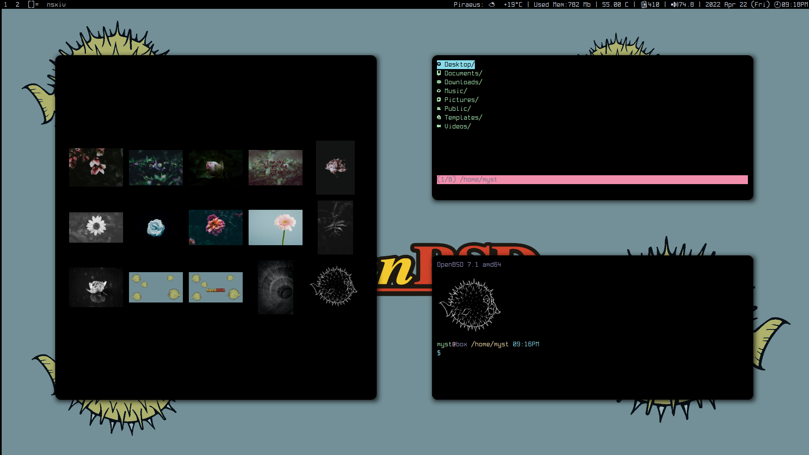
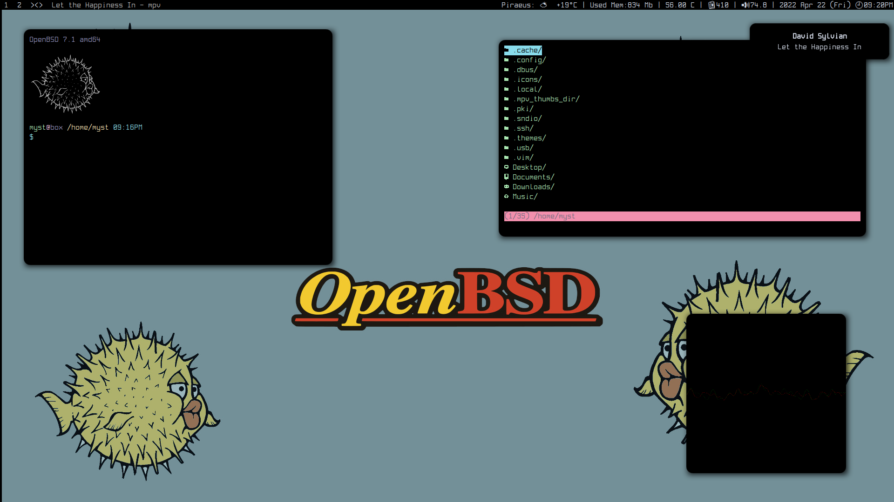

# openbsd-cyberpunk-dots
My personal DWM configuration for OpenBSD. Minimal and full black!!

1. You will need a OpenBSD installation.
2. Clone the repo as user in to your home dir: `git clone https://github.com/unixobserver/openbsd-cyberpunk-dots.git` 
3. Run as root `pkg_add doas vim`
4. Run `vim /etc/doas.conf` and add the following line `permit persist username keepenv as root` and save it. Don't forget to change the word username with your user.
5. Cd on openbsd-cyberpunk-dots folder and run on terminal `doas pkg_add -l programs`
6. cd ~/openbsd-cyberpunk-dots/.local/suckless and doas make clean install inside on each folder (dwm, dmenu, st, dwmblocks)
7. Copy all files from ~/openbsd-cyberpunk-dots on to your home directory ~/
8. Run chmod +x ~/.local/bin/* and xdg-user-dirs-update. Put your songs in the Music folder and mkdir ~/Videos/movies and put inside your movies.
9. Enjoy!!

## Basic Shortcuts

- **mod4 + enter        :** launch terminal
- **mod4 + shift +enter :** scratchpad term
- **mod4 + q            :** close apps 
- **mod4 + f            :** fullscreen
- **mod4 + shift + f    :** floating windows mode
- **mod4 + t            :** tabbed windows mode
- **mod4 + space        :** swap windows
- **mod4 + shift + q    :** reboot-poweroff-logout-lock 
- **mod4 + e            :** launch fff file manager
- **mod4 + shift + e    :** launch pcmanfm file manager
- **mod4 + p            :** launch nsxiv picture browser
- **mod4 + shift + p    :** launch pulsemixer
- **mod4 + ]            :** increase volume
- **mod4 + shift + ]    :** dmenu wallpaper selector
- **mod4 + [            :** decrease volume
- **mod4 + n            :** launch newsboat news
- **mod4 + shift + n    :** launch notes preview
- **mod4 + i            :** launch htop
- **mod4 + shift + i    :** launch top
- **mod4 + o            :** launch Orca-C sequencer
- **mod4 + shift + o    :** launch lmms DAW
- **mod4 + m            :** launch ncmpcpp player
- **mod4 + shift +m     :** launch dmenu movies playlist
- **mod4 + v            :** play random song with mpv 
- **mod4 + F5           :** mount usb flashdrive
- **mod4 + F6           :** ffmpeg sreen + audio recording
- **mod4 + F7           :** kill ffmpeg
- **mod4 + w            :** launch web browser (install ublock-origin, dark-reader plugins and complete black chrome theme)
