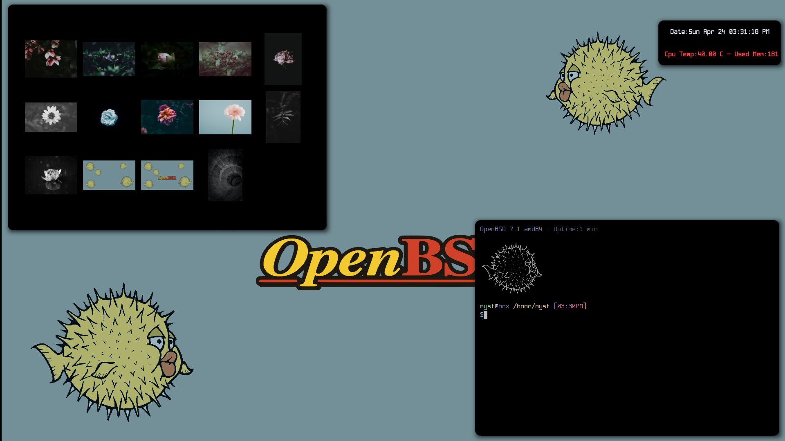

# openbsd-cwm-dots
My personal CWM configuration for OpenBSD. Please read first the Wiki and the instructions!!

1. You will need a OpenBSD installation.
2. Clone the repo as user in to your home dir: `git clone https://github.com/unixobserver/openbsd-cyberpunk-dots.git` 
3. Run in terminal as root `vi /etc/doas.conf` and add the following line `permit persist username keepenv as root` and save it. Don't forget to change the word `username` with your user.
4. cd ~/openbsd-cyberpunk-dots folder and run on terminal `doas pkg_add -l programs`
5. Copy all files from ~/openbsd-cyberpunk-dots on to your home directory ~/
6. Run in terminal  `cd ~/.local/suckless/st-flexipatch` and run `doas make clean install`.
7. Run in terminal `chmod +x ~/.local/bin/*` and `xdg-user-dirs-update`. Put your songs in the Music folder and run `mpc update`  and` mkdir ~/Videos/movie`s and put inside your movies.
8. Unzip `.themes.zip` and `.icons.zip` in to your home folder. `rm -rf .themes.zip .icons.zip`
9. Enjoy!!

## Basic Shortcuts

- **mod4 + enter        :** launch terminal
- **mod4 + shift +enter :** programs launcher
- **mod4 + q            :** close apps 
- **mod4 + space        :** swap windows
- **mod4 + shift + q    :** reboot-poweroff-logout-lock 
- **mod4 + e            :** launch fff file manager
- **mod4 + shift + e    :** launch pcmanfm file manager
- **mod4 + p            :** launch nsxiv picture browser
- **mod4 + shift + p    :** launch cmixer
- **mod4 + ]            :** increase volume
- **mod4 + shift + ]    :** dmenu wallpaper selector
- **mod4 + [            :** decrease volume
- **mod4 + n            :** launch newsboat news
- **mod4 + shift + n    :** launch notes preview
- **mod4 + i            :** launch htop
- **mod4 + shift + i    :** launch mycpu info notifier
- **mod4 + o            :** launch Orca-C sequencer
- **mod4 + shift + o    :** launch lmms DAW
- **mod4 + m            :** launch ncmpcpp player
- **mod4 + shift +m     :** launch dmenu movies playlist
- **mod4 + v            :** play random song with mpv 
- **mod4 + F5           :** mount usb flashdrive
- **mod4 + shift + F5   :** unmount usb flashdrive
- **mod4 + F6           :** ffmpeg sreen + audio recording
- **mod4 + shift + F6   :** kill ffmpeg
- **mod4 + w            :** launch Chromium web browser (install ublock-origin, dark-reader plugins and complete black chrome theme)
